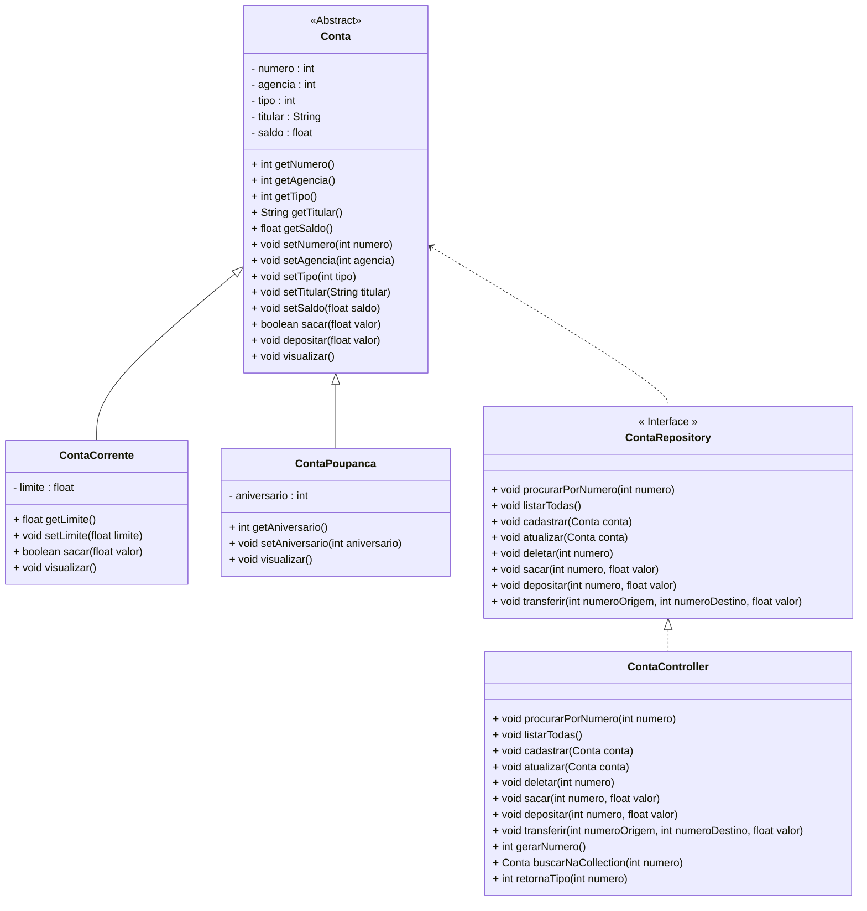

<h1>Projeto 01 - Conta Bancária - Iniciando o Projeto Java</h1>

<h2>1. O Projeto Conta Bancária</h2>

Este projeto consiste em uma aplicação Java para gerenciamento de contas bancárias, com as classes e interfaces a seguir:

Classes e Interfaces:

Classe/Interface Descrição
Menu Classe principal, que contém o método main, responsável por criar o Menu inicial da aplicação com todas as funcionalidades do sistema.
Cores Classe utilitária, que possui a função de aplicar cores ao Menu.
Conta Classe responsável por definir o objeto Conta genérico.
ContaCorrente Classe responsável por definir o objeto Conta Corrente.
ContaPoupanca Classe responsável por definir o objeto Conta Poupança.
ContaRepository Interface responsável por encapsular os métodos que serão utilizados no Menu da aplicação.
ContaController Classe responsável por implementar a interface ContaRepository.

A classe Menu é responsável por apresentar as opções de funcionalidades do sistema ao usuário, como criar uma nova conta, depositar e sacar dinheiro, verificar o saldo, entre outras. A classe Cores é uma classe utilitária que permite aplicar cores ao menu para melhorar a experiência do usuário.

As classes Conta, ContaCorrente e ContaPoupanca representam os tipos de contas que o sistema pode gerenciar. A classe Conta é a classe base, enquanto as outras duas classes herdam dela e adicionam atributos específicos. Por exemplo, a classe ContaCorrente pode ter uma taxa de juros e um limite de crédito, enquanto a classe ContaPoupanca pode ter uma taxa de juros diferenciada.

A interface ContaRepository encapsula os métodos que serão utilizados na aplicação, como criar uma nova conta, deletar uma conta existente, listar todas as contas etc. A classe ContaController implementa essa interface e realiza as operações necessárias no sistema bancário.

Este projeto pode ser executado em qualquer ambiente Java com as dependências necessárias instaladas. Para executar o projeto, é necessário compilar as classes e executar a classe Menu.

